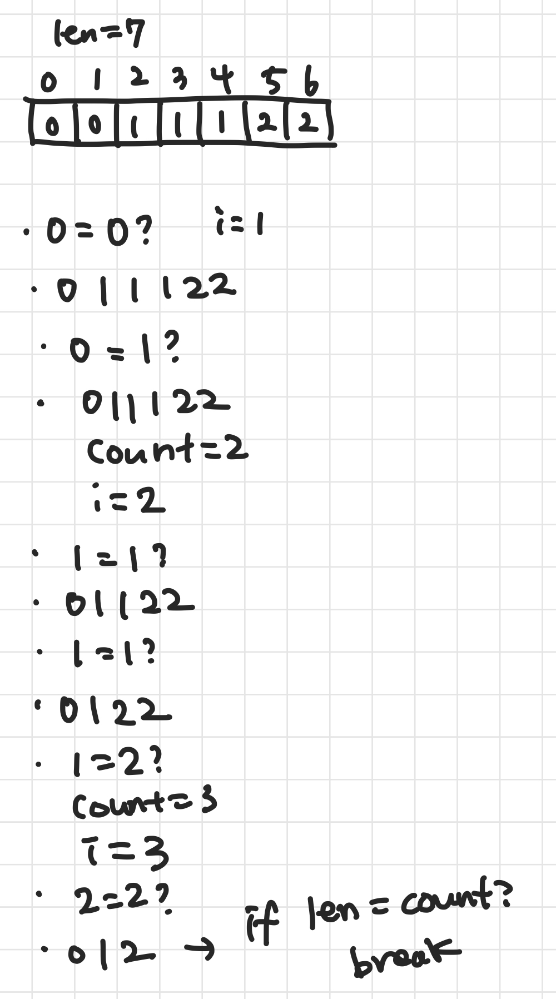

# 문제

- 새 배열을 만들지 않고 중복 값을 제거한다.

# 제출 답안



- 어차피 length > 1이기 때문에 두번째부터 확인하면 된다.
- 반복하다 보니 현재 인덱스와의 비교 대상 되는 인덱스가 count과 같게 되는 규칙을 발견했다.
    - 변수를 따로 둘 필요가 없어 count로 대체했다.
- 중복되지 않고 오롯이 혼자인 걸 계산한 게 결국 length니까 이 둘이 같으면 반복문을 빠져나오게 했다.
- 반복문도 있지만 그 안에서도 pop(i) 때문에 O(N)이 더 걸린다.

## 모범 답안

```python
class Solution(object):
    def removeDuplicates(self, nums):
        k = 0  # pointer one

        # pointer two
        for i in range(len(nums)):
            # here, we`ll check if last pointer value is equivalent to next value(second pointer value) or not
            if nums[k] == nums[i]:
                # if its same we won`t removing it for now.
                pass
            else:
                # once we find the different value then the first pointer, we`ll store it next to the last pointer. In that way we`ll make a sorted required series. 
                nums[k + 1] = nums[i]
                # then we`ll increase the first pointer.
                k += 1

        return k + 1        
```

- 48ms
- 나는 중복되는 것들을 제거하는 것에 초점을 맞췄다.
- 이 풀이는 중복은 신경 안쓰고 넘어가다가 다른 수를 발견하면 냅다 꽂는다.
- pop(i) 대신 바로 옮기기 때문에 시간이 줄어드는 것으로 추측된다.

```text
0, 0, 1, 1, 1, 2, 2, 3, 3, 4
```

- k = 0
    - i = 1
        - 0 == 0 ?
            - pass
        - 1번 포인터와 같은 값이 나오면 넘어간다.
    - i = 2
        - 0 == 1 ?
            - nums[1] = 1
            - k = 1
        - 1번 포인터와 다른 값이 2번 포인터에서 나오면 1번 다음 칸에 2번 값을 넣는다.
        - 1번 포인터와 2번 포인터 사이에는 어차피 중복된 값만 있을거니까 신경 안 쓰고 그냥 넣어버리는 것!